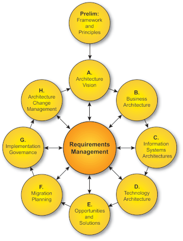
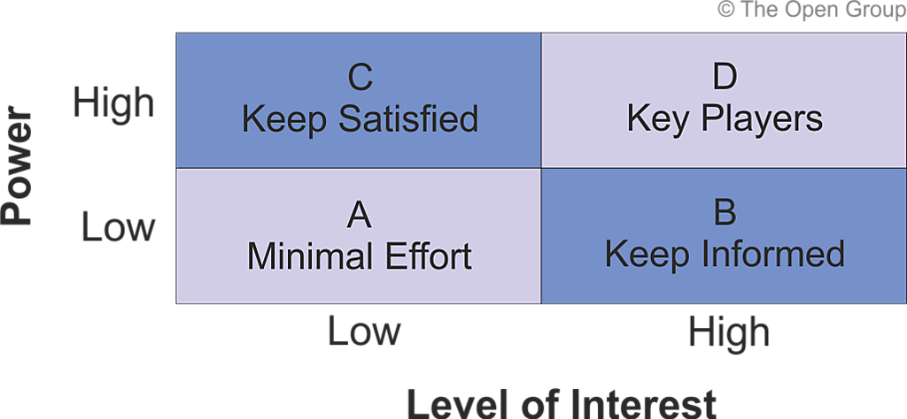

Standard 9.2 - Part 1 Foundation Enterprise Architect Course: https://pipefish.udemy.com/course/togaf-part1

Architect Development Method (ADM)

Existing standard: ISO / IEC / IEEE - 42010:2011

TOGAF 9 Certification includes: part 1 (foundation), part 2 (certified)

The TOGAF 9.2 Standard: https://pubs.opengroup.org/architecture/togaf9-doc/arch/
- Part 1 = Introduction
- Part 2 = Architect Development Method (ADM)
- Part 3 = Guidelines and Techniques
- Part 4 = Architecture Content Framework
- Part 5 = Enterprise Continuum
- Part 6 = Architecture Capability Framework

# Core Concepts
- The definition of enterprise
  - highest level description of an organisation
- Architecture domain or BDAT (Business Data Application Technology)
  - Business domain = purpose of the business, why in business, what are you hoping to achieve
  - Data domain = data assets, how data is handled
  - Application domain = how individual application developed and deployed and how they are related
  - Technology domain = computers, networks, middleware
- Architecture development method or ADM
  - Prelimary Phase
  - Phase A: Vision
  - Phase B,C,D: BDAT
  - Phases E,F: Planning
  - Phase G: Implementation
  - Phase H: Change Management
  - Requirements Management Phase (ongoing)
- Deliverabilies, artifacts and building blocks
  - Artifacts = Lists, Matrices, Diagrams
  - Deliverable = contractually specified and in turn formally reviewed, agreed and signed off by the stakeholders
  - Building blocks
    - architecture building blocks (ABB's) = named concepts that can be reused in other places
    - solution building blocks = implementations of the ABB's
    - Example:
      - ABB = ability to look up a customers info
      - SBB = CRM customer search module
- Enterprise continuum
  - A way of classifying items in the architecture repository
  - From Generic to Specific:
    - Foundation Architectures
    - Common Systems Architecture
    - Industry Architectures
    - Organisation Specific Architecture
- Architecture repository
  - Central storage for important architecture documents
  - Architecture Metamodel
  - Architecture Capability
  - Architecture Landscape
  - Standards Information Base (SIB)
  - Reference Library
  - Governance Log
  - Architecture Requirements Repository
  - Solutions Landscape
- Architecture capability
  - An evaluation of your architecture capability
  - Capability has a relationship to governance and repository
    - Governance: process runs according to the way its defined
    - Capability: people and processes
    - Repository: artifacts

# Architecture Development Method (ADM)

**ABITOMIA**
- **A**chitecture vision
- **B**usiness architecture
- **I**nformation systems architectuyre (data, applications)
- **T**echnology architecture
- **O**pportunities and solutions
- **M**igration planning
- **I**mplementation governance
- **A**rchitecture change management

A to H

## ADM - Prelimary Phase
- Define the architecture capability desired
- Establish the architecture capability 
- Define architecture principles
- where, what , why, who, how we do architecture

Inputs:
- The TOGAF library
- Other architecture frameworks
- Board strategies and board business plans, business strategy, IT strategy, business principles, business goals and business drivers
- Major frameworks operating in the business (eg: SCRUM)
- Governance and legal frameworks, including architecture governance strategy

Steps:
- Scope the enterprise organisations impacted
- Confirm governance and support frameworks
- Define and establish architecture team
- Identify and establish architecture principles
- Tailor TOGAF and other frameworks
- Implement architecture tools

Outputs: (Part 1 Exam)
- Organisational Model for Enterprise Architectures
- Tailored Architecture Framework
- Initial Architecture Repository
- Business principles, business goals, and business drivers
- Request for Architecture Work 
- Architecture Governance Framework

Artifacts Produced:
- Principles catalog

## ADM - Phase A: Architecture Vision
- establishing the business goals
- develop a high-level aspirational vision of the business value to be delivered
- include emerging technologies that impact your industry
- obtain approval for a statement of architecture work

Inputs:
- Architecture reference materials
- Request for architecture work
- business principles, business goals and business drivers
- Organisational model for Enterprise architecture
- Tailied Arch Framework
- Populated arch respository

Steps:
- Establish architecture project
- Identify stakeholders, concerns and business requirements
- Confirm business goals, drivers and constraints
- Evaulate capabilities 
- Assess readiness for transformation
- Define scope
- Confirm architecture principles, including business principles
- Develop architecture vision
- Define the target architecture value and KPIs
- Identify transformation risks and mitigation activtieis
- Develop statement of architecture work, secure approval

Outputs: (Part 1 Exam)
- Approved Statement of Architecture work
- Refined Statements of business principles, goals and drivers
- Architecture principles
- Capability assessment
- Tailored architecture framework
- Architecture vision
- Draft architecture definition document (version 0.1 draft, starter)
- Communications plan
- Additional content in the architecture repository

Artifacts produced:
- Matrices: stakeholder map matrix
- Diagrams: Business model diagram, Business capability map, Value stream map, Value chain, Solution concept diagram

## ADM - Phase B: Business Architecture
- develop the target business architecture
- identify candidate architecture roadmap items based on gaps
- based on the architecture vision from previous phase

Inputs:
- External reference materials
- Request for Architecture work (prelim Phase)
- business priciples, goals, and drivers (phase A)
- Capability assessment (phase A)
- Communications Plan (phase A)
- Organisation model for Ent Arch (prelim phase)
- Tailored arch framework (prelim phase)
- Approve statement of arch work (phase A)
- Architecture principles (phase A)
- Enterprise continuum 
- Architecture repository
- Architecture Vision (phase A)
- Draft architecture definition document (phase A)

Steps:
- Select reference models, viewpoints and tools
- Develop baseline business architecture description
- Develop target business architecture description
- Perform gap analysis
- Define candidate roadmap components
- Resolve impacts across the architecture landscape
- Conduct formal stakeholder review
- Finalize business architecture
- Create architecture definition document (1.0)

Outputs:
- Refined Phase A deliverables
- Draft architecture definition document
  - Baseline business architecture v1.0
  - Target business architecture v1.0
- Draft architecture requirements specification - gap analysis
- Business architecture components of an architecture roadmap

Artifacts:
- processes and business related
- Catalogs, Matrices: business interaction matrix, Diagrams

## ADM - Phase C: Information Systems Architecture
- Contains 2 phases in 1: Define data and application architectures
- develop the target information systems architectures
- identify the candidate architecture roadmap items based on gaps

## ADM - Phase C: Information Systems Architecture - Data Architecture
Inputs: from previous phases

Steps:
- Select reference models, viewpoints and tools
- Develop baseline business architecture description
- Develop target business architecture description
- Perform gap analysis
- Define candidate roadmap components
- Resolve impacts across the architecture landscape
- Conduct formal stakeholder review
- Finalize data architecture
- Create architecture definition document (1.0)

Outputs:
- Refined Phase A deliverables
- Draft architecture definition document
  - Baseline business architecture v1.0
  - Target business architecture v1.0
- Draft architecture requirements specification - gap analysis
- Data architecture components of an architecture roadmap

Artifacts:
- catalogs: data entity / data component catalog
- matrices: data entity / business function matrix, application/data matrix
- diagrams: conceptual, logical diagram, data dissemination, data security, data migration, data lifecycle

## ADM - Phase C: Information Systems Architecture - Application Architecture

Inputs: from previous phases
Steps: as above
Outputs: as above

Artifacts:
- catalogs: applciation portfolio, interface catalog
- matrices: app/org matrix, role/application, application function, application interaction
- diagrams: app communication, app and user location, app user-case, enterprise manageability, software engineering, application mgiration, software distribution

## ADM - Phase D: Technology Architecture
- develop the technology architecture
- identify the candidate architecture roadmap items based on gaps
- look for opportunities using emerging technologies

Inputs: 
- from previous phases
- Product information on candidate products

Steps:
- Select reference models, viewpoints and tools
- Develop baseline business architecture description
- Develop target business architecture description
- Perform gap analysis
- Define candidate roadmap components
- Resolve impacts across the architecture landscape
- Conduct formal stakeholder review
- Finalize data architecture
- Create architecture definition document (1.0)

Outputs:
- Refined Phase A deliverables
- Draft architecture definition document
  - Baseline business architecture v1.0
  - Target business architecture v1.0
- Draft architecture requirements specification - gap analysis
- Technology architecture components of an architecture roadmap

Artifacts:
- catalogs: technology strandards, technology portfolio
- matrices: app/technology
- diagrams: environments and locations, platform decomposition, processing, networked computering/hardware, communications engineering

## ADM - Phase E: Opportunities and Solutions
- generate the initial architecture roadmap
- identify if transition architectures are required
- define solution building blocks (SBB's)

Inputs: 
- from previous phases
- Product information
- Planning Methodologies
- Change requests for existing business programs and projects
- Candidate architecture roadmap components

Steps:
- Determine key corporate change attributes
- Determine business contraints
- Review and consolidate gap analysis from Phase B to D
- Review consolidated requirements across business functions
- Consolidate and reconcile interoperability requirements
- Define and validate dependencies
- Confirm readiness and risk for business transformation
- Formulate implmentation and migration strategy
- Identify and group major work packages
- Identify transition architectures
- Create the architecture roadmap & implementation and migration plan

Outputs:
- Refined Phase A Deliverables
- Draft architecture definition document: incl. baseline and target v1.0
- Draft architecture requirements specification: incl. gap analysis
- Capability assessments
- Architecture roadmap version 0.1
- Implementation and migration plan version 0.1

Artifacts:
- Diagrams: product context, benefits

## ADM - Phase F: Migration Planning
- Finalize the architecture roadmap and migration plan
- Ensure migration plan is aligned with enterprise approach to change
- ensure business value and costs of work packages is understood

Inputs:
- from previous phases

Steps:
- Confirm management framework interactions
- Assign a business value to each work package
- Estimate resource requirements, project timings, etc
- Prioritize the mgiration projects
- Confirm architecture roadmap and update architecture definition document
- Generate implementation and migration plan
- Complete the architecture development cycle, lessons learned

Outputs:
- Implementation and Migration Plan v1.0
- Finalized arch def doc
- Finalized arch requirements
- Finalized arch roadmap
- Reusable Arch building Blocks (ABB's)
- Requests for Architectyre work for next ADM cycle
- Implementation of governance model
- Change requrest for architecture capability from lessons learned

Artifacts:
- None

## ADM - Phase F: Implementation Governance
- Ensure conformance
- Perform architecture governance

Inputs:
- From previous phases
- Architecture contract

Steps:
- Confirm Scope and Priorities for Deployment
- Identify Deployment Resources and Skills
- Guide Development of Solutions Deployment
- Performance Enterprise Architecture Compliance Reviews
- Implement Business and IT Operations
- Perfroamcne Post-Implementation Review and Close the Implementation

Outputs:
- Architecture Contract = joint agreement between development partners and sponsors on the deliverables, quality, and fit-for-purpose of an architecture
- Compliance assessments
- Change requests
- Architecture-compliant solutions deployed

Artifacts:
- None

## ADM - Phase H: Architecture Change Management
- Maintain architecture lifecycle, governance, capability

Inputs:
- From previous phases

Steps:
- Establish value realization process
- Deploy monitoring tools
- Manage risks
- Provide Analysis for Architecture Change Management
- Develop Change Requirements to Meet Performance Targets
- Manager Governance Process
- Activate the process to Implement Change

Outputs:
- Architecture updates
- Change to arch framework and principles
- New Request for Architecture Work
- Statement of architecture work
- Architecture contract
- Compliance assessments

Artifacts:
- None

## ADM - Requirements Management
- Its a phase but constant
- Continuous process of handling change during any phase of the ADM process
- Being able to handle change at any time is crucial for the ADM to succeed
- Purpose: ensure the process is sustained through all phases
- Purpose: manage change while the ADM cycle is in progress
- Purpose: provide the requirements to each ADM phase

# ADM Guidelines and Techniques
- ADM with Architecture Styles
  - for example: TOGAF has a Service Oriented Arch (SOA) work group
- Architecture Principles
  - 5 Elements of Good Principles
    - Understandability = can explain easily
    - Robustness = definitive and precise no vagueness
    - Completeness = cover all situations
    - Consistency = no contradictions and consistent with each other
    - Stability = enduring and not changing
- Stakeholder management
  - Establish a communications plan to keep them informed
  - identify problems and conflicts early in order to avoid them

- Architecture Patterns
  - Is the when, why and how you use and limitations
  - Once you have developed a number of building blocks, you may want to establish patterns for them
- Business Scenarios
  - 1. A business process, application or set of applications
  - 2. The business and technology environment
  - 3. The people and software system "actors" involved
  - 4. The desired outcome
  - Anyone should be able to understand a business problem and solution by reading the business scenario
  - A neatly laid out business case
- Gap Analysis
  - Baseline architecture vs Target architecture
  - Gaps are anything added, changed or intentionally omitted
  - Will also identify things accidently omitted
  - it should be clear and easy to explain why things were added or removed
- Migration Planning
  - Phase F
  - Implementation Factor Assessment & deduction matrix
  - Consolidated Gaps, Solution and dependencies
  - Architecture definition increments table
  - Transition architecture state evolution
  - business value assessment
- Interoperability
  - The ability to share information and services
  - business interop: how business teams work together
  - information interop: how data is shared
  - technical interop: how tech services connect to one another
- Business Readiness Transformation Assessment (BRTA)
  - evaulting and quantifying an organisations readiness to undergo change
  - no point creating architecture if it'll be ignored
  - understanding how to get your organisation to change is a key to success
  - Recommended Activities:
    - Determine the readiness factors that will impact the organisation
    - Present the readiness factors using maturity models
    - Assess the readiness factors, including determination of readiness factor ratings
    - Assess the risks for each readiness factor and identify improvement actions to mitigate the risk
    - Work these action into Phase E and F implementation and Migration Plan
  - Readiness Factors
    - Vision
    - Desire, Willingness, Resolve
    - Need
    - Business Case
    - Funding
    - Leadership, Sponsor, Champion
    - Governance
    - Accountability
    - IT Capacity to Execute
    - Enterprise Capacity to Execute
- Risk Management
  - What are the risks of migrating to the target architecture
  - Identify them, and track them
  - Initial Level of Risk = exists if you do nothing to mitigate them
  - Residual Level of Risk = remains after you have mitigated them
- Capability Planning

# Architecture Governance
- System of controls over architecture, how you make changes
- Ensure compliance with architecture
- Accountability to the business for that
- Principles of good governance:
  - Discipline
  - Transparency
  - Independence
  - Accountability
  - Responsibility
  - Fairness